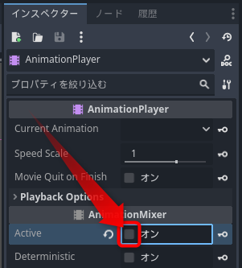

ご意見、ご要望、間違いの報告などは、[Issues](https://github.com/am1tanaka/GodotResearchNoteBook2/issues)にお願いします。

## 正誤表

今のところ、ありません。

## 補足

入稿後に分かったことや気づいた補足です。

### p80「6.4 AnimatinoTree を設定したあとのアニメの追加」

書籍の方法よりも、AnimationPlayerや、AnimationTreeのActiveを無効にするのがセオリーのようです（図1）。

設定を戻すのを忘れるケアレスミスの原因になり兼ねないため、好ましい対策とは思えません。[こちら(Chris' Tutorials. Animation Tree State Machine Setup w/ Conditions & BlendSpace2D - Godot 4 Resource Gatherer Tutorial)の動画](https://youtu.be/WrMORzl3g1U?feature=shared)を見たところ、Activeは無効にしておいて、スクリプトで実行時に有効にしていました。

やはり、編集中は自動的には動かさず、再生ボタンなどを用意してほしいと考える次第です。

## 本書の執筆環境

前回に続いて、今回も[Techbooster](https://techbooster.booth.pm/)さんの[ReVIEW-Template](https://github.com/TechBooster/ReVIEW-Template)を拝借して、本文の入稿データを作成しました。Windowsでの環境の構築については、以下に記載しています。

- [【Windows】Re:VIEWで書籍用のPDFを作成する](https://am1tanaka.hatenablog.com/entry/2023/09/15/235402)
- [【Windows】Re:VIEWの校正環境を構築する](https://am1tanaka.hatenablog.com/entry/2023/09/23/223924)
- [Re:VIEW関連の記事一覧](https://am1tanaka.hatenablog.com/archive/category/Re%3AVIEW)

## 関連リンク
- [STORM OF BALLS](https://am1tanaka.itch.io/storm-of-balls)
- [Minecart Rails](https://am1tanaka.itch.io/minecart-rails)
- [グラチェン!!](https://godotplayer.com/games/grachan)
- [場面切り替えサンプル](https://github.com/am1tanaka/ChangeSceneSample)
- [次元ドア](https://itch.io/jam/brackeys-11/rate/2524745)
- [カタチナゲル](https://am1.games/katachi/)
